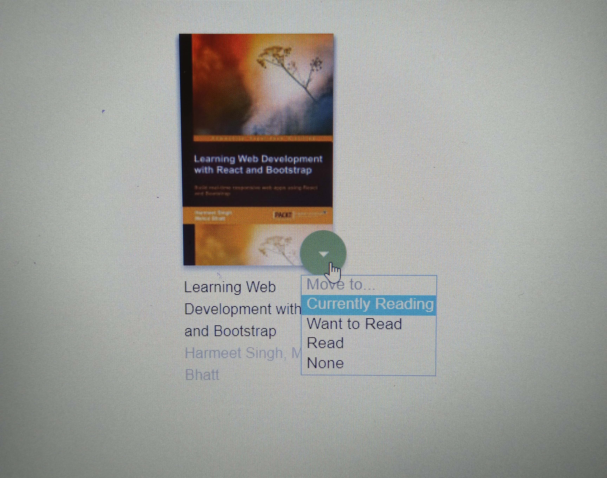

# MyReads Project
This is MyReads project. This project can be used to search for book titles and store them on different shelves
depending on what you are currently reading, what you have read and what you would like to read.

# How to use app:
Here are some steps to use app.

* ### Installation
In order to install and use this project you must run two commands in the console.
1) `npm install`
2) `npm start`

These two commands will install all of the dependencies needed for this project and will start the server

* ## Book Shelves
On first page , you will see three shelves `Cureently Reading` `Want To Read` `Read`

### Select on which shelf you want that book.

### Route to search page 
At the end of the page, there is a `add` button, when you will click that you will route to `/search` page.

* ## Search 
Here you can search any book, and you can move them in different shelves.

